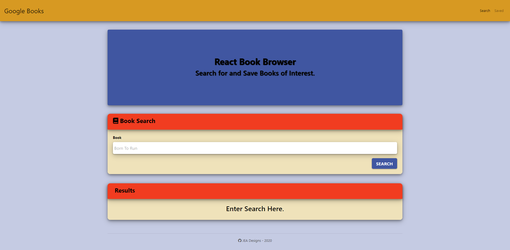

# React Book Browser

## Description  

[App Link](https://enigmatic-fortress-71623.herokuapp.com/)

A MERN stack application allowing a user to search for books and save them to a MongoDB database to view and purchase later. 

* 

 
 
 

## Table of Contents  

* [Usage](#usage-instructions)  
* [License](#license)  
* [Questions](#questions)

 
 
 

## Usage Instructions

* 
* Application is hosted live using GitHub.  Use this [Link](https://enigmatic-fortress-71623.herokuapp.com/) to try it out!
* Simply use the input field to type book title you would like to find and hit the search button. 
* A list of related books will be generated.  Add books to your list by hitting the save button.  
* View the Google book page by hitting view, where you can purchase or find out more info.
* Using the Saved button on the navigation bar you can see the books you have saved for later.
* By using the delete button, books can be removed from your saved list.  

 
 
 

## License

* Application licensed under MIT.  For more information see [license document](./LICENSE).
  
 
 
 

## Questions

Check out my GitHub page here:  [jeashwor's Page](https://github.com/jeashwor)

If you have additional questions please email me at jeashwor@gmail.com